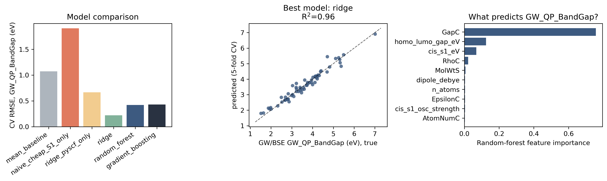
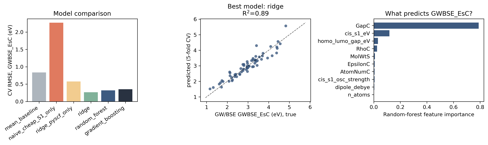
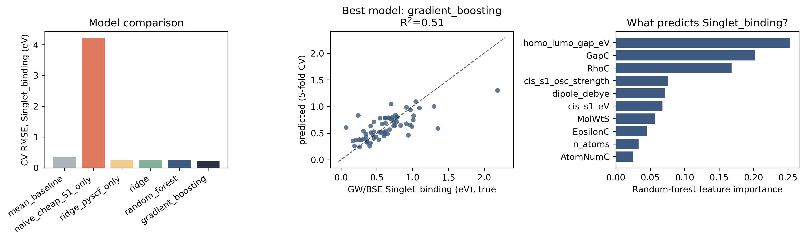
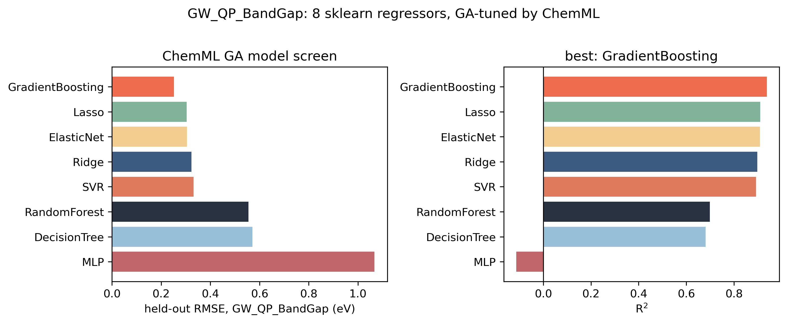
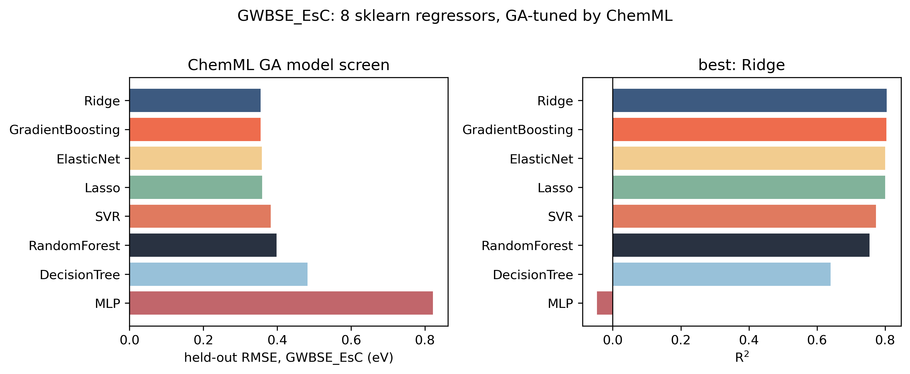
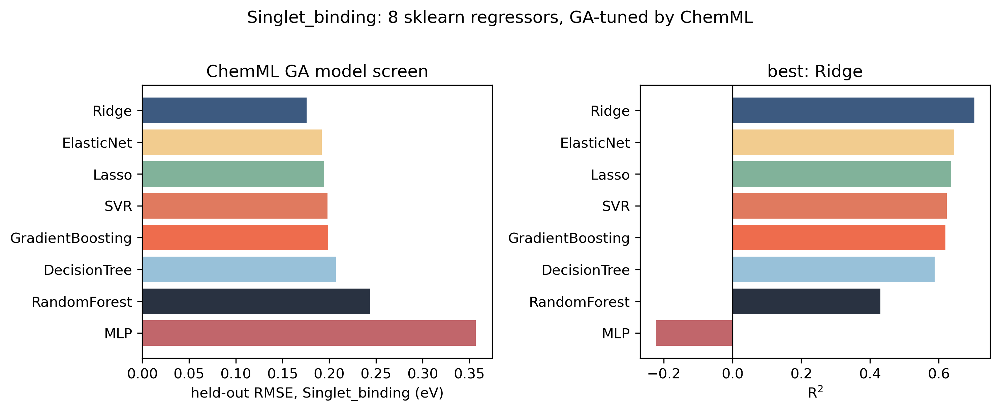

# PAH101 cheap-to-expensive ML surrogate — results

## Scope and provenance

- Cheap step: PySCF, Hartree-Fock/STO-3G single point + one CIS (TDA) excited state, on the isolated gas-phase monomer extracted from each PAH101 CIF.
- 55-atom size cap kept every calculation under ~1 minute on a single core.
- Expensive labels: GW quasiparticle band gap and GW+BSE exciton energies, taken directly from the PAH101 table (already computed at that level for all 101 crystals — no new expensive calculations were run here).
- ML: scikit-learn Ridge / Random Forest / Gradient Boosting, 5-fold cross-validation.
- Geometries reused from prior preprocessing (`pah_gap_ml/geometries` via symlink).

## Dataset yield

- 101 PAH101 monomers available as XYZ.
- 68 succeeded at the cheap-PySCF step (0 excluded: none).
- **64 PAH101 crystals** have both cheap descriptors and expensive GW/BSE labels — this is the ML dataset.

## Model performance (5-fold cross-validated)

### GW_QP_BandGap

| Model | RMSE (eV) | MAE (eV) | R$^2$ |
|:---|---:|---:|---:|
| Mean baseline | 1.071 | 0.821 | -0.059 |
| Trust cheap S1 as-is (no ML) | 1.905 | 1.802 | -2.350 |
| Ridge, PySCF features only | 0.667 | 0.441 | 0.590 |
| Ridge, PySCF + tabulated | 0.219 | 0.163 | 0.956 |
| Random Forest, PySCF + tabulated | 0.421 | 0.251 | 0.837 |
| Gradient Boosting, PySCF + tabulated | 0.428 | 0.251 | 0.831 |

### GWBSE_EsC

| Model | RMSE (eV) | MAE (eV) | R$^2$ |
|:---|---:|---:|---:|
| Mean baseline | 0.838 | 0.643 | -0.064 |
| Trust cheap S1 as-is (no ML) | 2.269 | 2.205 | -6.813 |
| Ridge, PySCF features only | 0.576 | 0.377 | 0.497 |
| Ridge, PySCF + tabulated | 0.266 | 0.205 | 0.892 |
| Random Forest, PySCF + tabulated | 0.320 | 0.219 | 0.845 |
| Gradient Boosting, PySCF + tabulated | 0.351 | 0.223 | 0.814 |

### Singlet_binding

| Model | RMSE (eV) | MAE (eV) | R$^2$ |
|:---|---:|---:|---:|
| Mean baseline | 0.343 | 0.249 | -0.033 |
| Trust cheap S1 as-is (no ML) | 4.216 | 3.727 | -155.367 |
| Ridge, PySCF features only | 0.263 | 0.173 | 0.393 |
| Ridge, PySCF + tabulated | 0.246 | 0.169 | 0.467 |
| Random Forest, PySCF + tabulated | 0.263 | 0.168 | 0.394 |
| Gradient Boosting, PySCF + tabulated | 0.235 | 0.163 | 0.513 |

## ChemML AutoML, second opinion

Same dataset, handed to ChemML's `ModelScreener` instead: it fits 8 sklearn regressors (Ridge, Lasso, ElasticNet, SVR, decision tree, random forest, gradient boosting, MLP) and GA-tunes each one's hyperparameters. Numbers below are its own held-out RMSE/R$^2$, not the 5-fold CV above, so don't directly compare row-for-row -- just look at which model wins.

### GW_QP_BandGap

| Model | RMSE (eV) | MAE (eV) | R$^2$ |
|:---|---:|---:|---:|
| GradientBoosting | 0.252 | 0.184 | 0.938 |
| Lasso | 0.304 | 0.210 | 0.910 |
| ElasticNet | 0.305 | 0.211 | 0.909 |
| Ridge | 0.323 | 0.234 | 0.898 |
| SVR | 0.331 | 0.243 | 0.892 |
| RandomForest | 0.555 | 0.458 | 0.699 |
| DecisionTree | 0.571 | 0.462 | 0.681 |
| MLP | 1.067 | 0.892 | -0.114 |

### GWBSE_EsC

| Model | RMSE (eV) | MAE (eV) | R$^2$ |
|:---|---:|---:|---:|
| Ridge | 0.355 | 0.216 | 0.804 |
| GradientBoosting | 0.355 | 0.225 | 0.804 |
| ElasticNet | 0.359 | 0.240 | 0.801 |
| Lasso | 0.359 | 0.242 | 0.800 |
| SVR | 0.382 | 0.248 | 0.773 |
| RandomForest | 0.398 | 0.274 | 0.754 |
| DecisionTree | 0.482 | 0.346 | 0.640 |
| MLP | 0.822 | 0.726 | -0.046 |

### Singlet_binding

| Model | RMSE (eV) | MAE (eV) | R$^2$ |
|:---|---:|---:|---:|
| Ridge | 0.176 | 0.142 | 0.703 |
| ElasticNet | 0.192 | 0.149 | 0.645 |
| Lasso | 0.195 | 0.150 | 0.636 |
| SVR | 0.198 | 0.157 | 0.623 |
| GradientBoosting | 0.199 | 0.153 | 0.619 |
| DecisionTree | 0.207 | 0.161 | 0.588 |
| RandomForest | 0.244 | 0.206 | 0.431 |
| MLP | 0.357 | 0.306 | -0.223 |

## Take-aways

Ridge on top of the cheap PySCF numbers gets most of the way to the GW band gap and the GW+BSE exciton energy for this PAH set. The exciton *binding* energy is a tougher nut -- makes sense, since it's an electron-hole interaction effect that a single-particle HF/STO-3G calculation was never going to capture well. None of this generalizes past PAH-type crystals; it's a cheap shortcut for this family, not a GW/BSE replacement.
