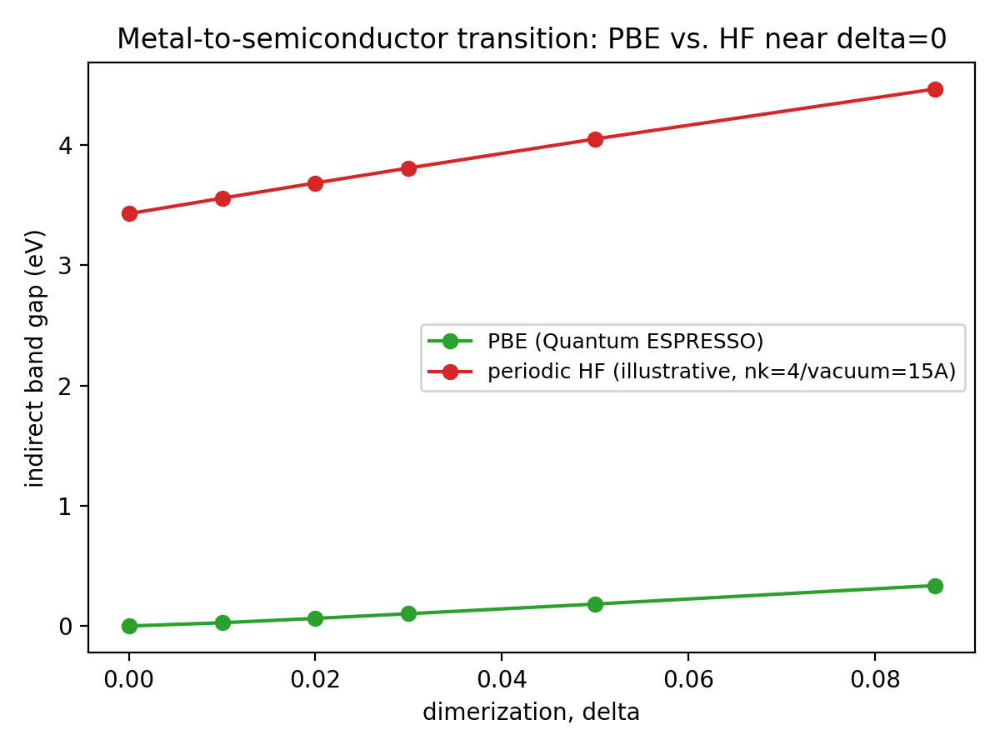
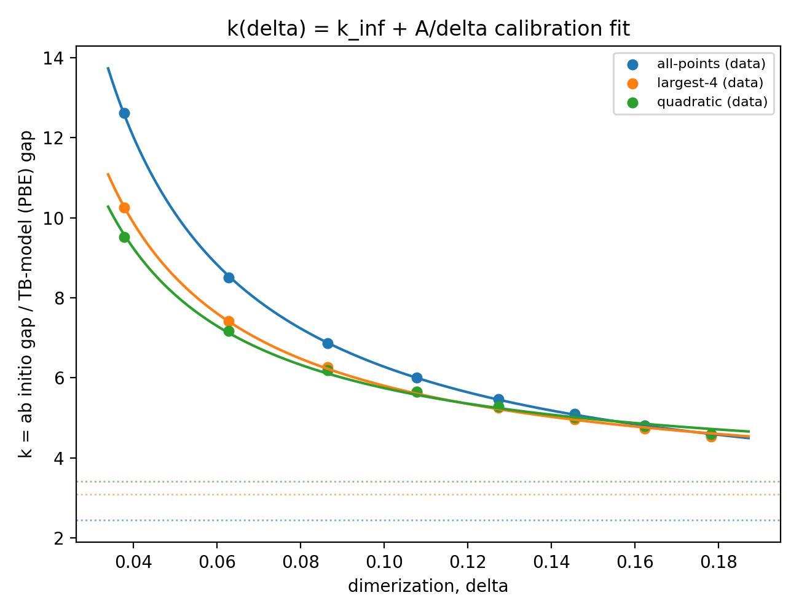
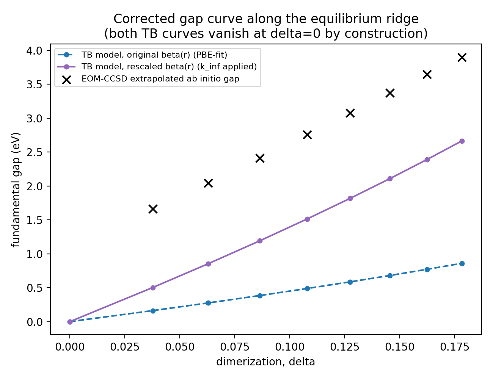
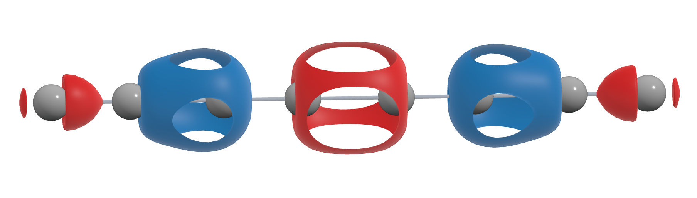

# Exciton Self-Trapping in Silver Atomic Chains: Ab Initio Parametrization and Nonadiabatic Dynamics in Libra

CyberTraining 2026 Workshop Report

## 1. Introduction

Photoexcited electron-hole pairs (excitons) in low-dimensional materials can locally distort the surrounding lattice enough to trap themselves in place — a polaron-like effect known as exciton self-trapping. This report studies that phenomenon in a one-dimensional chain of silver atoms, using a tight-binding (TB) model built for exactly this purpose, and follows the project through three stages:

- A pre-existing single-orbital TB model for Ag atomic chains, with a nearest-neighbor hopping term and a phenomenological electron-hole interaction term designed to produce a bound exciton in real-time Ehrenfest dynamics. The model, its plane-wave DFT (PBE) parametrization, and its original implementation live in [github.com/estebangadea/TB_Ag_excitons](https://github.com/estebangadea/TB_Ag_excitons); the parametrization itself is documented in `Ag_chains_parametrization.pdf`. In brief, the hopping integral and repulsive potential take the forms
  ```
  beta(r) = beta(r_eq) + A*(r - r_eq)^q      (q = 1 here)
  V(r)    = -beta(r_eq) * B * (r_eq/r)^p
  ```
  with a phenomenological electron-hole term `f_xc^A = -alpha * sum_B dq_B / sqrt(r_AB^2 + gamma^2)` driving exciton formation in real-time Ehrenfest dynamics. Neither the PBE-derived band gap nor the hand-picked coupling strength `alpha` was anchored to a level of theory beyond semi-local DFT.
- **Part I**, below: correcting the magnitude of that band gap and obtaining a physically grounded exciton binding-energy estimate using higher-level quantum chemistry (pySCF), while preserving the qualitative physics (the metal-to-semiconductor Peierls transition) that the original PBE fit gets right.
- **Part II**, below: porting the corrected model into Libra, the nonadiabatic molecular dynamics package used throughout this workshop, and running real-time excited-state dynamics to observe — and directly visualize — exciton self-trapping.

---

# Part I: Ab Initio Correction of the PBE Band Gap and Exciton Binding Energy Estimate

## 1.1 Objective

Use pySCF-based quantum chemistry (Hartree-Fock and post-HF: EOM-IP/EA-CCSD, CIS/TDA, CAM-B3LYP TDDFT) to:

1. correct the magnitude of the TB model's band gap using a higher level of theory, while preserving the qualitatively correct metal-to-semiconductor (Peierls) transition that PBE gets right and HF/post-HF methods do not, and
2. obtain a physically-grounded estimate of the exciton binding energy that the `f_xc`/`alpha` term is meant to represent.

## 1.2 Background

PBE is known to systematically underestimate band gaps. The natural instinct is to replace the PBE gap with one from a higher level of theory. This is not trivial for two reasons, both resolved in the course of this work:

- **Double counting.** If a correlated method (CISD, CASSCF, EOM-CCSD, ...) is used to compute a *neutral* excitation (an optical gap), it already contains electron-hole binding — using it as the TB model's single-particle gap would double-count the same physics the `alpha`/`f_xc` term is meant to supply separately. The fix is to compute the *fundamental* (quasiparticle) gap as a charged excitation, IP − EA, rather than a neutral excitation. This is the same conceptual split GW+BSE makes between a quasiparticle gap and an optical gap; BSE itself was ruled out as beyond the scope of this project.
- **Method choice for the charged gap.** IP/EA can be obtained several ways. Frozen-orbital CASCI and relaxed open-shell (UHF) delta-SCF were both tried and abandoned — the former lacks orbital relaxation and gives an unphysical gap, and the latter hits the same multiple-local-minima instability as CASSCF on this near-degenerate system, with no natoms-convergence to speak of. The TB model's own exciton is a neutral, same-electron-count excitation, so there was never a strict requirement to leave the closed-shell world for this problem in the first place. Two closed-shell-safe routes were used instead: Koopmans' theorem (`eps_LUMO - eps_HOMO` from a plain RHF calculation, an upper bound on the true IP) and EOM-IP/EA-CCSD (adds real dynamical correlation on top of a single closed-shell CCSD reference, without ever constructing an open-shell wavefunction).

## 1.3 Strategy

**Ab initio recipe.** All calculations use pySCF, the `gth-pbe`/`gth-szv-molopt-sr` pseudopotential/basis pair (the only Ag combination bundled by default with pySCF; carries the full 4d^10 5s^1 valence manifold, not just the 5s band the TB model represents), and isolated finite Ag_n clusters (even n, symmetric dimer-pair termination) rather than periodic supercells for the correlated (CCSD, TDDFT) steps, since those methods don't support k-point sampling.

**The metal-to-semiconductor test (Figure 1).** A quick periodic HF scan near delta=0 shows the gap does *not* vanish at the undimerized limit (~3.4 eV at delta=0, rising with dimerization) — a known HF/post-HF failure for 1D half-filled metals (missing screening/correlation, the same class of effect documented for polyacetylene). PBE, by contrast, gives exactly 0 eV at delta=0 for every lattice length tested. This rules out simply replacing the PBE-fit `beta(r)` with an HF-derived one: doing so would break the one qualitative feature the whole project depends on.

**Fundamental gap benchmark: EOM-IP/EA-CCSD.** Chosen over extended Koopmans' theorem because it has a direct, well-tested pySCF implementation (`cc.CCSD(mf).ipccsd()`/`.eaccsd()`) built on a single closed-shell reference. Validated by finite-size convergence (natoms = 2 to 12) and cross-checked sign conventions against Koopmans at the same geometries.

**The rescaling idea.** Rather than discard PBE's shape, keep it and apply a single multiplicative correction to `beta(r)`'s dimerization-sensitive slope: `k = (ab initio fundamental gap) / (TB-model gap)`, evaluated at several dimerized reference geometries. Because the TB model's gap is `gap = 2|beta(a1) - beta(a2)|`, at delta=0 both bonds are equal length and the gap vanishes identically *for any overall scale of `beta(r)`* — a multiplicative rescaling cannot break the metal-to-semiconductor transition, unlike an additive correction would risk doing.

**Calibration and its 1/delta artifact (Figure 2).** k was evaluated at 8 points along the model's equilibrium ridge (lattice_length 5.8-6.5 Å, dimerization 0.038-0.178, increasing together) using the natoms-extrapolated EOM-CCSD fundamental gap. k falls sharply with delta (12.6 to 4.6 across the range) and fits essentially perfectly to `k(delta) = k_inf + A_fit/delta` (max residual < 0.13 across all 8 points, all three natoms-extrapolation flavors). This divergence has a physical origin, not a numerical one: the EOM-CCSD fundamental gap itself does not vanish at delta=0 (Koopmans gaps stay at 5-7 eV regardless of dimerization, the same HF-inherited pathology as Figure 1), while the TB/PBE gap in the denominator correctly does — dividing a non-vanishing quantity by one that vanishes necessarily diverges. Fitting out the 1/delta term isolates `k_inf`, the delta-independent part of the correction, from that artifact.

**Exciton binding energy.** Binding energy = fundamental gap − optical gap, tested with three combinations (Figure 4): Koopmans + CIS/TDA (baseline, fully closed-shell, both bare/unscreened), EOM-CCSD fundamental + CIS optical (tests whether correlating the fundamental gap alone is enough), and Koopmans fundamental + CAM-B3LYP TDDFT optical (tests whether screening the optical/exciton side alone is enough). A phenomenological dielectric-scaled CIS test (dividing the entire CIS coupling term by a scalar epsilon) was also tried early on, back when the binding energy was being compared against the *original*, uncorrected model's `|alpha| ~ 0.5 eV` stability ceiling and every ab initio estimate looked too large by 1-5x: it implied an effective screening strength (epsilon ~ 4-5) physically plausible for this system, as a way to bring the binding energy down further. With the corrected (larger) `beta(r)` from this objective, the model's own stability ceiling should scale up with it (Section 1.5), so this extra screening correction is likely unnecessary — kept here for the record, not adopted.

## 1.4 Results

### 1.4.1 The metal-to-semiconductor transition is real in PBE and absent in HF



*Figure 1. Indirect band gap vs. dimerization near delta=0 at lattice_length=6.0 Å. PBE (green) vanishes exactly at delta=0, as required by the Peierls physics. Periodic HF (red, illustrative settings: nk=4, vacuum=15 Å — the qualitative point was independently confirmed at full production settings, nk=16/vacuum=30 Å, during the feasibility preflight check) sits at ~3.4 eV even at delta=0 and only rises further with dimerization.*

### 1.4.2 k(delta) calibration



*Figure 2. k = ab initio gap / TB-model gap at the 8 calibration points, fit to k(delta) = k_inf + A_fit/delta for each of three natoms-extrapolation flavors (all-points, largest-4, quadratic). Horizontal dotted lines mark each flavor's k_inf asymptote.*

| flavor | k_inf | A_fit | max residual |
|---|---|---|---|
| all-points | 2.451 ± 0.013 | 0.383 ± 0.001 | 0.030 |
| largest-4 | 3.090 ± 0.033 | 0.271 ± 0.003 | 0.079 |
| quadratic | 3.417 ± 0.060 | 0.233 ± 0.005 | 0.130 |

The three flavors disagree by about 40% with each other (2.45 to 3.42), reflecting the same natoms-extrapolation ambiguity present throughout this project. **Adopted: k_inf = 3.1**, the largest-4 flavor (3.090 ± 0.033) rounded to one decimal place — preferred over all-points and quadratic for the same reason natoms-extrapolation reliability was judged throughout this project: the smallest-natoms points are the least converged, and all-points weights them equally instead of downweighting them.

### 1.4.3 The corrected model



*Figure 3. Fundamental gap vs. delta along the equilibrium ridge: the original PBE-fit TB model (dashed blue), the k_inf-rescaled model using the adopted k_inf = 3.1 (solid purple), and the actual EOM-CCSD extrapolated ab initio points (black x). Both TB curves vanish at delta=0 by construction. The rescaled curve is deliberately NOT fit to pass through the ab initio markers point-by-point — those markers still carry the 1/delta artifact from Figure 2 at the smaller-delta end, which k_inf was specifically constructed to remove. The gap between the purple line and the black markers is that artifact, shrinking with delta exactly as expected.*

Applying the adopted k_inf = 3.1 to the original model: `beta_eq = -0.668653 eV`, `r_eq = 2.604816 Å`, and `q = 1` are unchanged; only the dimerization-sensitive slope changes, A: 0.371035 → 1.150209 eV/Å (rounded 1.1502). **The corrected hopping expression is therefore:**

    beta_new(r) = -0.668653 + 1.1502 * (r - 2.604816)      [eV, r in Angstrom]

with the original repulsive potential `V(r) = -beta_eq · B · (r_eq/r)^p` (B = 0.231122, p = 15) carried over unchanged for now — flagged in Section 1.6 as requiring its own re-fit against this new A. **Note:** Section 1.6's subsequent joint re-fit against the DFT PES ends up moving r_eq substantially (beta_eq, satisfyingly, comes back out of that re-fit essentially unchanged — see Section 1.6). This does not retroactively affect anything in this section or in Section 1.4.2's calibration: `gap = 2*A*|a1 - a2|` depends only on A and the geometry (l, delta) — beta_eq and r_eq cancel completely, not just approximately, so no gap computed anywhere in this report changes regardless of how much r_eq moves. Only the repulsive fit (Section 1.6) and downstream quantities that depend on the *absolute* value of `beta(r)` (e.g. bandwidth, total energy) are affected.

**Why only A, not beta_eq, is rescaled.** `gap = 2|beta1 - beta2| = 2*A*|a1 - a2|` — beta_eq cancels *exactly* in that subtraction, for any value of delta, not just approximately at small delta. So the calibration data (which measures only the gap) constrains A alone; it says nothing about beta_eq's correctness, at any dimerization. Rescaling beta_eq as well would not change the fit to the calibration points at all (the gap is identical either way), so it can't be justified as "more correct" on that basis. The honest reason it's tempting is a different one: if PBE's underestimate is a generic effect (e.g. too little self-interaction correction, favoring delocalization) rather than something specific to the dimerization-splitting mechanism, beta_eq itself (which sets the bandwidth, ~4|beta_eq| for the undimerized chain) might plausibly be underestimated by a similar factor. That would need its own ab initio benchmark — a bandwidth calculation, analogous to what was done here for the gap — which this project has not done (the finite-cluster CCSD/Koopmans calculations measure only the fundamental gap, not a periodic bandwidth). Note also that rescaling A alone is not fully bandwidth-neutral away from l = 2·r_eq: the valence bandwidth is `|beta1+beta2| - |beta1-beta2|`, and `beta1+beta2 = 2·beta_eq + A·(l - 2·r_eq)`, so A does leak into the bandwidth once l departs from 2·r_eq (≈5.21 Å) — at the largest calibration lattice length (6.5 Å), l − 2·r_eq ≈ 1.29 Å and this A-dependent term is already *larger in magnitude* than beta_eq itself (1.48 eV vs. 0.67 eV with the rescaled A, versus 0.48 eV with the original A). So rescaling A alone already changes the bandwidth substantially at the more-stretched end of the equilibrium ridge, even with beta_eq untouched — this isn't a fully isolated "gap-only" change in practice, just the one that's actually constrained by data. Rescaling beta_eq too is a plausible but currently untested extrapolation, worth flagging as a candidate refinement if an ab initio bandwidth estimate becomes available.

### 1.4.4 Exciton binding energy


*Figure 4. Exciton binding energy vs. 1/natoms for three method combinations. The Koopmans+CIS baseline and CAM-B3LYP-screened-optical curves converge to essentially the same value (~2.8-3.1 eV) — CAM-B3LYP's screening speeds up finite-size convergence but does not lower the true converged answer. Only correlating the fundamental gap (EOM-CCSD) meaningfully reduces the binding energy, to ~1.2-1.4 eV extrapolated.*

The most-corrected estimate (~1.2-1.4 eV) is larger than the model's original alpha stability ceiling (`|alpha| ~ 0.5 eV`) — but that ceiling was calibrated against the *original*, smaller hopping scale, and this objective's whole point is that `beta(r)` is now larger (Section 1.4.3). Whether ~1.2-1.4 eV is actually workable under the new, rescaled `beta(r)` is being checked directly in Section 1.7.

**A harder constraint emerged once the re-fit model's actual equilibrium geometry was known (Section 1.6):** at l = 6.0 Å the model's own equilibrium dimerization is delta = 0.095665, giving a fundamental gap of 1.32 eV there. A bound exciton's binding energy cannot exceed the fundamental gap it is binding within (the optical gap = fundamental gap − binding energy must stay positive) — so the top of the EOM-CCSD range (~1.4 eV) is ruled out outright at this geometry, and even ~1.2-1.3 eV would leave only a very small optical gap (0.02-0.12 eV). This tightens, rather than resolves, the open question from Section 1.4.4: either the true binding energy sits well below the ~1.4 eV end of the EOM-CCSD range, or the EOM-CCSD extrapolation itself is still an overestimate for the reasons already flagged (Koopmans neglects relaxation; CIS/TDA and CAM-B3LYP under-screen relative to full GW+BSE). Section 1.7's TB+Ehrenfest scan is evaluated with this bound in mind.

### 1.4.5 Orbital character: the excited electron is on the Ag 5s manifold

Natural Transition Orbital (NTO) analysis of the lowest CIS/TDA excited state (natoms=8, lattice_length=6.0 Å, delta=0.0864) gives direct, visual support for the single s-band TB picture:

| NTO pair | weight | hole 5s-character | electron 5s-character |
|---|---|---|---|
| 1 (dominant) | 0.697 | 0.000 | 0.554 |
| 2 | 0.191 | 0.000 | 0.440 |
| 3 | 0.074 | 0.000 | 0.233 |

Across all three leading pairs, the hole carries essentially zero Ag 5s character (it is p/d-derived), while the electron carries substantial and consistent 5s character.



*Figure 5. Isosurface of the dominant-pair electron NTO (natoms=8, lattice_length=6.0 Å, delta=0.0864), rendered from `report/nto_cubes/electron_nto.cube`. The electron density sits on the Ag 5s-derived band, consistent with the single s-band picture the TB model assumes.*

## 1.5 Discussion and Limitations

- **k_inf is a fit-extrapolated quantity, not raw data**, and disagrees by ~40% across natoms-extrapolation flavors (2.45-3.42). This is the dominant source of uncertainty in the whole correction.
- **Only 8 calibration points, along a single (equilibrium) ridge** of the (lattice_length, delta) surface. The 1/delta fit is well-constrained within the tested range but is an extrapolation outside it, particularly toward delta=0 where it is not meant to be trusted (that is precisely the regime the correction is designed to route around).
- **The repulsive potential has been re-fit (Section 1.6)** against the new A, with r_eq allowed to move substantially (justified since the gap depends only on A); beta_eq comes back out of the re-fit unchanged. The re-fit reproduces the DFT equilibrium delta and near-equilibrium curvature well; residual mismatch in the tails is attributed to PBE's own known PES softness rather than a fitting deficiency.
- **The re-fit model's actual equilibrium gap (1.32 eV at l = 6.0 Å) caps the plausible exciton binding energy** — a binding energy cannot exceed the gap it lives inside of, which rules out the top of the EOM-CCSD range (~1.4 eV) outright (Section 1.4.4). This is a model-internal bound, independent of alpha.
- **The alpha stability ceiling has been scanned directly (Section 1.7)** against the rescaled model. Binding energy grows super-quadratically with alpha over the range tested (0.8-1.6), reaching only ~0.03-0.21 eV — well short of the ab initio estimate even after accounting for the gap bound above. Whether higher alpha remains stable, and whether it can close that gap, is the open question going forward (see Part II, where alpha=2.0 eV is used for the production dynamics runs).

## 1.6 Re-fitting of the Interatomic (Repulsive) Potential

With A fixed at its ab initio-corrected value (1.150209 eV/Å, Section 1.4.3), the repulsive potential was re-fit against the DFT total-energy PES using the same Monte Carlo procedure as the original parametrization (Section 4 of `Ag_chains_parametrization.pdf`), now allowing beta_eq and r_eq to vary jointly with B and p rather than holding them at their original values. This is justified rather than arbitrary: as established in Section 1.4.3, the fundamental gap depends only on A, l, and delta — beta_eq and r_eq cancel out of it completely — so nothing about the ab initio gap calibration constrains them, and they are legitimately free parameters for the purpose of matching the DFT potential energy surface.

**Fitting conventions.** Energies on both sides are compared relative to their own minimum, not in absolute terms. The TB energy surface is evaluated on an 80-pair chain while the DFT reference is a single unit cell sampled over many k-points, so the two are only comparable after the appropriate per-cell scaling. The fit weights configurations with (E − E_min) < 0.1 eV more heavily than higher-energy ones, since the latter are geometries the system is unlikely to explore during the dynamics of interest. The raw PES data behind the fit (`TBenergy.dat`, `DFT_energysurface.dat`) are archived in `Step3_calibration/refit_data/` for reference; the Monte Carlo fitting code itself is not reproduced in this repository — see [`TB_Ag_excitons`](https://github.com/estebangadea/TB_Ag_excitons) for the full procedure.

**Result** (superseding an earlier version of this fit that had a bug; corrected below):

    beta_final(r) = -0.668653 + 1.150209 * (r - 3.989152)     [eV, r in Angstrom]
    V(r)          = -beta_eq * B * (r_eq / r)^p,  B = 0.032205,  p = 8

| Parameter | Original | Re-fit |
|---|---|---|
| beta_eq (eV) | −0.668653 | −0.668653 (unchanged) |
| r_eq (Å) | 2.604816 | 3.989152 |
| A (eV/Å) | 0.371035 | 1.150209 (unchanged from Section 1.4.3) |
| B | 0.231122 | 0.032205 |
| p | 15 | 8 |

**beta_eq comes back out of the re-fit exactly unchanged** — a satisfying consistency check. It confirms the Section 1.4.3 argument directly: nothing about matching the DFT PES actually wants to move beta_eq, since it is genuinely under-constrained by any of the ab initio data used in this project. r_eq, by contrast, shifts substantially (2.60 → 3.99 Å). This is not a claim about the true physical Ag-Ag bond length — the physical bond lengths that come out of the model are set by where the *total* energy (electronic + repulsive) is minimized, and at the l=6.0 Å reference geometry that still lands at a1 ≈ 3.29 Å, a2 ≈ 2.71 Å, an ordinary range for this system. r_eq is a reference length internal to the V(r) power-law form, not a physical bond length in its own right, and is free to move as the fit trades it off against p and B.

The exponent p dropping from 15 to 8 is the structurally important change, and was anticipated before the fit was run: p sets both how quickly V(r) decays once r exceeds r_eq and how quickly it stiffens once r drops below r_eq — a single exponent governing both the wall's "reach" and its steepness. With A roughly tripled, the electronic energy gain from dimerizing is much stronger over a wider range of bond length, and a repulsive wall as steep as p = 15 decays away almost entirely before it can resist that pull at longer lattice lengths, while overshooting DFT once the compressed bond gets close enough to r_eq to feel it. A smaller p gives the repulsion longer reach and a gentler rise on both sides — exactly the behavior needed to counterbalance a stronger, wider-acting electronic term.

The re-fit reproduces the DFT equilibrium dimerization well (delta ≈ 0.09 at l = 6.0 Å, matching the reference geometry used throughout this project) and tracks the curvature near it closely; the main residual is at the tails, where the TB curve sits somewhat below or above the DFT one. This residual most plausibly reflects PBE's own known tendency to under-stiffen potential energy surfaces (a generic GGA deficiency related to self-interaction/delocalization error) rather than a shortcoming of the refit itself — the refit is being asked to match a repulsive term against an electronic term that is now *more* correct than PBE (Section 1.4.2's ab initio gap correction) while the reference PES it's fit against is still PBE's own, somewhat too-soft, total energy surface. Since the equilibrium geometry and near-equilibrium force constants (what matters for the Ehrenfest dynamics downstream) are reproduced well, this residual is not considered a blocker.

## 1.7 Binding Energy as a Function of Alpha

TB+Ehrenfest binding energy was scanned as a function of the phenomenological electron-hole coupling strength alpha, under the re-fit model (Section 1.6):

| alpha | binding energy (eV) |
|---|---|
| 0.8 | 0.030 |
| 1.0 | 0.059 |
| 1.2 | 0.096 |
| 1.4 | 0.141 |
| 1.6 | 0.212 |

Binding energy grows super-quadratically with alpha over this range (BE/alpha² rises from 0.047 at alpha=0.8 to 0.083 at alpha=1.6, rather than staying flat) — consistent with approaching, but not yet reaching, the kind of instability that sets in as alpha grows further (Section 1.5). None of the tested alpha values come close to the ab initio target: even at alpha=1.6, the binding energy (0.21 eV) is an order of magnitude below the EOM-CCSD estimate (~1.2-1.4 eV, Section 1.4.4), and well below the harder gap-based ceiling of 1.32 eV established in Section 1.4.4.

This leaves two possibilities, not mutually exclusive: (1) alpha needs to be substantially larger than 1.6 to reach ab initio-scale binding energies, and it remains to be seen whether such values are numerically/dynamically stable — the accelerating BE(alpha) trend above suggests the ceiling may not be far past this range; or (2) the EOM-CCSD estimate itself remains an overestimate of the true binding energy (both legs of that calculation are known to be one-sided, as already noted in Sections 1.4.4 and 1.8's discussion), and the true, phenomenologically-achievable binding energy is closer to the tens-of-meV to few-hundred-meV scale seen here. Part II's production dynamics runs use alpha=2.0 eV, extending this scan into the range needed to actually see self-trapping develop.

## 1.8 Conclusion of Part I

This objective produced a TB parametrization that reproduces both physically relevant limits the original, purely-PBE-based model could not simultaneously guarantee from first principles: the metal-to-semiconductor transition (inherited intact from PBE's `beta(r)` shape, protected exactly by the model's own structure) and a band gap magnitude anchored to a correlated, closed-shell-safe ab initio method (EOM-IP/EA-CCSD) for sufficiently dimerized geometries, where PBE's underestimate is largest. NTO analysis independently confirms the model's core assumption — that the relevant excited-state physics lives on a single Ag 5s-derived band. An ab initio estimate of the exciton binding energy (~1.2-1.4 eV, EOM-CCSD-based) is also in hand, understood as still likely an overestimate (both legs of the binding-energy calculation are known to be one-sided: Koopmans neglects relaxation, CIS/TDA and even CAM-B3LYP under-screen the electron-hole attraction relative to what full GW+BSE would give).

The corrected `beta(r)` and a properly re-derived alpha set up the next stage of this project: real-time nonadiabatic electron-nuclear dynamics, using the same Ehrenfest framework the original TB model was built for, now ported into Libra to take advantage of its broader method suite. With energetics now tied to ab initio input rather than hand-picked values, the natural question becomes dynamical rather than static — whether, and under what conditions, a photoexcited exciton locally distorts the lattice enough to self-trap. That is the subject of Part II.

---

# Part II: Porting to Libra and Simulating Exciton Self-Trapping

## 2.1 Motivation and Goal

The original TB model's dynamics were implemented directly (a custom Julia code propagating both the nuclei and the many-electron density matrix under Ehrenfest mean-field forces). This workshop's focus, Libra, offers a broader and more actively developed suite of nonadiabatic dynamics methods — surface hopping (FSSH and variants), decoherence corrections, and exact factorization — that go beyond the mean-field approximation Ehrenfest dynamics makes. The goal of this part of the project was to port the Ag-chain model into Libra as a custom Hamiltonian, reproduce the existing self-trapping physics inside Libra, and put the model in a position to eventually use Libra's fuller method suite.

## 2.2 Methodology

### 2.2.1 A reformulation, not just a port

Libra's dynamics engine is built around propagating a single quantum amplitude vector `C(t)` and the density matrix it implies, `rho = C * C(dagger)` — a "pure state" representation appropriate for a single particle or a single excitation. The Ag-chain model, however, was originally built around a many-electron, closed-shell mean-field density matrix, where most electronic levels are doubly occupied (`trace(rho) = n_electron`, not 1). These two objects don't have the same shape, and this mismatch needed to be resolved before any of Libra's dynamics methods could be used.

Two ways forward were considered: (1) reformulate the problem as a single quasiparticle — one electron-hole excitation propagating over a basis of many-body excited configurations — which is the mainstream approach for nonadiabatic dynamics of real materials and is exactly what Libra's machinery expects, or (2) use Libra only as a low-level matrix library and keep propagating the original many-electron density matrix by hand. The first path was chosen: it is a real reformulation of the physics, not just a change of software, but it is the only route that gives access to Libra's full toolkit, which is the actual point of doing this port.

Concretely, the reformulation recasts the exciton as a Configuration Interaction Singles (CIS), Tamm-Dancoff-approximation (TDA) problem built on top of the ground-state TB Hamiltonian: instead of a self-consistent electron-hole mean field, a fixed window of near-gap single-excitation configurations (occupied orbital → virtual orbital) is diagonalized to obtain the exciton's energy, wavefunction, and — with some care — analytic nuclear gradients. A subtlety was found and resolved along the way: the phenomenological electron-hole term only reproduces the correct (attractive, sub-gap) exciton binding if it enters the CIS matrix element's direct (Coulomb-like) slot alone, not the exchange slot — the term behaves like a TDDFT-style exchange-correlation kernel, not a literal two-body interaction subject to Pauli exchange.

A second, more technical complication was that the standard formula for how molecular orbital coefficients respond to a nuclear displacement breaks down for degenerate orbitals — and every orbital in this ring-shaped chain is exactly degenerate except the HOMO and LUMO themselves, a direct consequence of the ring's rotational symmetry. This blocked using more than the single dominant (HOMO→LUMO) configuration until a degenerate-perturbation-theory extension was derived and validated. That extension turned out to be exact, not approximate, and was necessary groundwork: a single, symmetric configuration is a rigid, fully delocalized state that has no way to spontaneously localize, so representing a spatially localizable exciton needs the wider window that fix enables.

### 2.2.2 Validation

The static electronic Hamiltonian (the hopping part alone, without the repulsive potential or the electron-hole term) was ported first and cross-checked against the project's existing Julia implementation, matching to ~7e-5 eV — the residual traced to a tabulated-vs-continuous hopping-formula difference already known to be negligible for molecular dynamics forces. The analytic nuclear gradients of the full CIS exciton energy (needed for Ehrenfest forces) were validated against finite differences, agreeing to 1e-6 to 1e-9 relative accuracy at multiple geometries and system sizes, both in a standalone numerical sandbox and inside the real Libra kernel. A full nonadiabatic-coupling formula between electronic states, derived independently for this orthonormal site basis via Slater-Condon rules, was checked against a brute-force many-electron Slater-determinant construction to machine precision (~1e-16).

Extensive development work with the original (pre-Part-I) hopping parameters established the methodology described above and first produced a self-trapping signature: a photoexcited exciton, given a small symmetry-breaking nudge (a low-temperature random velocity seed, since the perfectly symmetric ring and zero initial velocity give no channel for the exciton to spontaneously localize), was seen to progressively narrow the region of the lattice it occupies, with the localized hole and electron density co-localizing (the correct signature of a bound exciton, not charge separation) rather than dispersing. That work is treated here as methodology development, not as the reportable physics result — the production runs below repeat the same protocol with the ab initio-corrected Hamiltonian from Part I.

## 2.3 Simulation Setup

All production runs use a 32-unit-cell (64-site) dimerized Ag ring and the ab initio-corrected Hamiltonian from Part I (Section 1.6):

    beta(r) = -0.668653 + 1.150209 * (r - 3.989152)      [eV, r in Angstrom]
    V(r)    = -beta_eq * 0.032205 * (3.989152 / r)^8

with the electron-hole coupling term extended past Part I's Section 1.7 scan to `alpha = -2.0 eV`, `gamma = 1 bohr (~0.529 Å)` — large enough, per Part I's discussion, to plausibly reach a self-trapping regime.

Three Ehrenfest molecular dynamics runs were carried out from the equilibrium dimerized geometry:

1. **Unseeded exciton dynamics.** The system starts on the exciton potential energy surface with zero nuclear velocity. With the ring's exact symmetry and no velocity to break it, the exciton has no channel to spontaneously localize.
2. **Seeded exciton dynamics.** Identical setup, but nuclear velocities are drawn from a small random (Maxwell-Boltzmann) distribution rather than starting at exactly zero — a physically reasonable initial condition (a real system carries some thermal/zero-point nuclear motion at the instant of excitation) that gives the exciton a channel to break symmetry.
3. **Ground-state control.** The same velocity seed as run 2, but propagated on the ground-state potential energy surface instead of the exciton surface — isolates whether any structure seen in run 2 is actually driven by the exciton, rather than being an artifact of the random kick itself.

## 2.4 Results

*(Figures and quantitative results below are pending — to be inserted once the three production runs (`2.Exciton_trapping_Libra/production_runs/`) are pulled down from the CHPC cluster where they were executed. Each subsection names the exact expected figure so this can be filled in directly against the data; see `2.Exciton_trapping_Libra/README.md` for how each run/figure is produced.)*

### 2.4.1 Unseeded run: the exciton stays delocalized

<!-- TODO: insert 2.Exciton_trapping_Libra/report/figures/run1_unseeded_dynamics.png (from analyze_dynamics.py run1_unseeded) -- expected to show a spatially uniform response across the ring, the null result given the exact symmetry of the starting condition. -->

### 2.4.2 Seeded run: self-trapping

<!-- TODO: insert 2.Exciton_trapping_Libra/report/figures/run2_selftrapping_dynamics.png (from analyze_dynamics.py run2_selftrapping) -- the report's central figure: bond-distortion-vs-time and hole/electron density (IPR) heatmaps. Looking for the same qualitative signature established in methodology development: a narrowing, persistent region of lattice distortion with co-localized hole and electron density. Also insert run2_selftrapping_energy_conservation.png (from check_energy_conservation.py) to rule out numerical drift as the source of any growth. -->

### 2.4.3 Ground-state control: no trapping

<!-- TODO: insert 2.Exciton_trapping_Libra/report/figures/run3_control_dynamics.png (from analyze_dynamics.py run3_control) -- same velocity seed, ground-state surface, expected to show bounded oscillation rather than sustained growth. Also insert production_runs_comparison.png (from compare_runs.py) for the direct three-way visual contrast. -->

## 2.5 Ongoing Work: Nonadiabatic Coupling

A real, physically motivated coupling channel between the ground state and the exciton state was also derived and tested — this work is ongoing and not part of the production results above. The direct ground-to-exciton coupling turned out to be exactly suppressed by a symmetry cancellation specific to this system; a real (if weak, on the trajectories tested so far) coupling channel exists instead *within* the exciton manifold, between near-degenerate exciton sublevels. This finding is preliminary and is being followed up as part of the future work described below.

## 2.6 Discussion and Limitations

- The three production runs are Ehrenfest (mean-field) dynamics on a fixed pair of electronic surfaces (or, for the control, the ground surface alone) — genuine coherent population transfer between the ground and exciton states is not part of this model yet (see Section 2.5).
- Results are for a single 32-cell chain; the eventual physics goal (a two-chain moiré system) is deferred until the single-chain methodology is on solid footing.
- The electron-hole coupling parameters (`alpha=-2.0 eV`, `gamma=1 bohr`) were chosen to plausibly reach a self-trapping regime given Part I's Section 1.7 scan, rather than fit to an independent target; whether they correspond to a specific ab initio binding energy is not yet re-checked against Part I's methodology at these parameter values.

## 2.7 Future Work: Continued Use of Libra

The point of porting this model into Libra rather than continuing to extend the original Julia code was to gain access to Libra's broader nonadiabatic dynamics toolkit. With the mean-field baseline established here, the natural next steps, in priority order, are:

1. **Surface hopping (FSSH and variants).** A relatively low-effort, well-documented next step once real nonadiabatic coupling is available (Section 2.5) — tests directly whether the mean-field self-trapping result survives when trajectories are allowed to stochastically branch rather than average over outcomes, which is exactly the failure mode Ehrenfest dynamics is prone to for a genuinely branching phenomenon like self-trapping.
2. **A dedicated search for a near-crossing region** between the ground and exciton states (or between exciton sublevels), where the preliminary coupling result from Section 2.5 predicts population transfer should become much more significant — the natural next test of that finding.
3. **Decoherence corrections** (e.g. DISH, mSDM/IDA/SDM) on top of surface hopping — these directly address how the exciton's coherence, and hence its localization, decays over time, which bears directly on the self-trapping question.
4. **Exact factorization methods** (e.g. SHXF), as the most rigorous available treatment of coupled electron-nuclear dynamics, useful for settling whether self-trapping is genuine polaron physics or a mean-field artifact, once the baseline and decoherence results are in hand.
5. **Extension to the two-chain moiré system**, the eventual physics target of this line of work, once the single-chain methodology above is considered complete.

## 3. Overall Conclusion

This project took a hand-parametrized tight-binding model for exciton self-trapping in Ag atomic chains and put it on firmer ground in two ways: first, by anchoring its band gap and exciton binding energy to ab initio quantum chemistry rather than semi-local DFT and hand-picked parameters (Part I); and second, by porting its dynamics into Libra, which required a genuine reformulation of the underlying physics (a many-electron mean-field density matrix recast as a single-quasiparticle CIS/TDA problem) rather than a mechanical translation, and which opens the door to nonadiabatic dynamics methods well beyond mean-field Ehrenfest dynamics (Part II). The production dynamics runs under the corrected Hamiltonian are the direct continuation of Part I's static ab initio work into real-time, observable exciton self-trapping.
